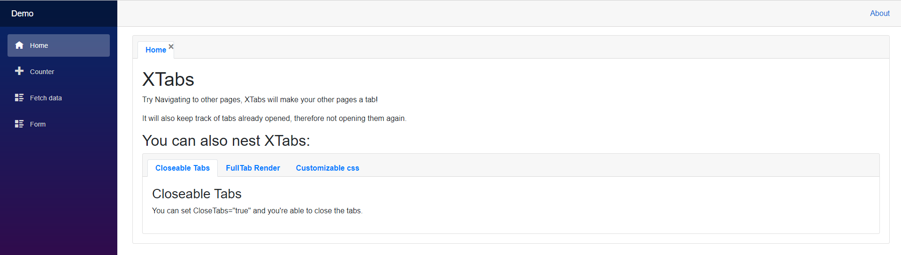

# XTabs
An extended tabs implementation.



## Main Features:
- Able to close tabs
- Able to navigate to page and render it as a tab
- Tabs won't duplicate when navigating to the same page
- Able to use the XTabs classes to further customize the look


## Setup: 
You can install the package via the nuget package manager just search for *Blazored.Modal*. You can also install via powershell using the following command.

```powershell
Install-Package XTabs
```

Or via the dotnet CLI.

```bash
dotnet add package XTabs
```
